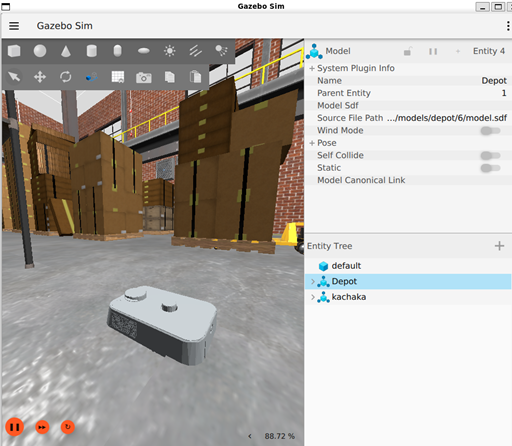
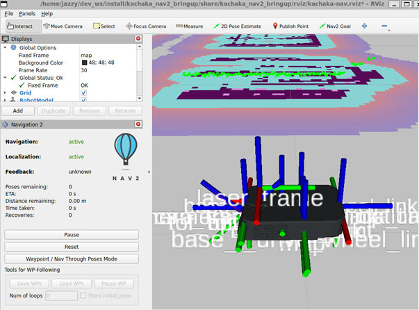

# kachaka_ros2_dev_kit

## はじめに

kachaka_ros2_dev_kitは、[カチャカ](https://kachaka.life/)を用いたROS 2ソフトウェア開発キットです。以下のパッケージ群から構成されています。

|パッケージ名|説明|
|---|---|
|kachaka_description|カチャカのdescriptionを記述するパッケージ。[kachaka_description](https://github.com/pf-robotics/kachaka-api/tree/v3.8.5/ros2/kachaka_description)から派生しています。|
|kachaka_interfaces|カチャカのアクション、メッセージファイルを管理するパッケージ。[kachaka_interfaces](https://github.com/pf-robotics/kachaka-api/tree/v3.8.5/ros2/kachaka_interfaces)から派生しています。|
|kachaka_nav2_bringup|Nav2 stackを起動するためのパッケージ。[kachaka_nav2_bringup](https://github.com/pf-robotics/kachaka-api/tree/v3.8.5/ros2/demos/kachaka_nav2_bringup)から派生しています。|
|kachaka_mapping|Mappingを起動するためのパッケージ|
|kachaka_gazebo|Gazebo Ignitionによるカチャカのシミュレーション環境を提供するパッケージ|
|utils/joy_controller|ユーティリティ|

kachaka_ros2_dev_kitは、カチャカ実機、シミュレーション環境で地図生成、自己位置推定、ナビゲーションを実行する機能を提供します。
シミュレーション環境（kachaka_gazeboパッケージ）を使ってナビゲーションを実行した例を下図に示します。

|シミュレーション環境|シミュレーション環境上でのナビゲーション実行例|
|:---:|:---:|
|||

## 動作確認環境

以下の環境で動作確認しました。

- Ubuntu 24.04
- ROS 2 Jazzy
- Gazebo Harmonic
- カチャカソフトウェア v3.8.5

`kachaka_gazebo`パッケージを使用する場合、シミュレーションやレンダリングの処理を高速にするため、NVIDIA GPU搭載環境での動作を推奨します。

## ビルド

```bash
sudo apt update
mkdir -p ~/dev_ws/src
cd ~/dev_ws/src
git clone https://github.com/CyberAgentAILab/kachaka_ros2_dev_kit.git
cd ..
rosdep install -y -i --from-paths src
colcon build --symlink-install
source ~/dev_ws/install/setup.bash
```

## 使い方

### シミュレータ環境

- シミュレータ環境：[kachaka_gazebo/README.md](kachaka_gazebo/README.md)参照。

### 地図生成

- シミュレータ環境：[docs/sim/mapping_sim.md](docs/sim/mapping_sim.md)参照。
  - 通常、カチャカ実機を使う場合、カチャカ本体で地図生成も行われていることから、この機能はシミュレータ環境でのみ動作確認しています。

### ナビゲーション

- カチャカ実機：[docs/navigation.md](docs/navigation.md)参照。
- シミュレータ環境：[docs/sim/navigation_sim.md](docs/sim/navigation_sim.md)参照。

## ライセンス

|パッケージ名|ライセンス|
|---|---|
|kachaka_description|Apache License, Version 2.0|
|kachaka_interfaces|Apache License, Version 2.0|
|kachaka_nav2_bringup|Apache License, Version 2.0|
|kachaka_mapping|Apache License, Version 2.0|
|kachaka_gazebo|Apache License, Version 2.0|
|utils/joy_controller|MIT|

## Acknowledgment

[kachaka_gazebo/worlds/eht_store.sdf](kachaka_gazebo/worlds/eht_store.sdf)はサツドラホールディングス株式会社様のご協力のもと、[EZOHUB TOKYO](https://ezohub.jp/office/tokyo/)で取得したデータを用いて作成されました。詳細は[スライド](https://www.docswell.com/s/dandelion1124/ZXE284-2025-01-07-150529)を参照ください。

## コントリビューション

以下のようなコントリビューションを歓迎しています。

- バグ報告
  - 本リポジトリでバグ報告のチケットを発行ください。
- バグ修正
  - 本リポジトリでプルリクエストを発行ください。また、どのチケットのバグを修正したものであるかを記載ください。ブランチ名にチケット番号が含まれていると対応付けがわかりやすいのでよいでしょう。
  - 修正確認手順、結果を記載ください。
- ドキュメント改善
  - 誤字脱字の修正、不足している情報の追加など
- 機能追加
  - 本リポジトリでプルリクエストを発行ください。機能追加した背景、どのような効果があるかを説明ください。
  - 動作確認手順、結果を記載ください。
