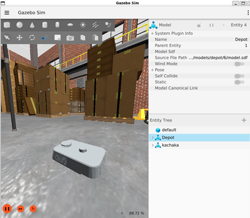
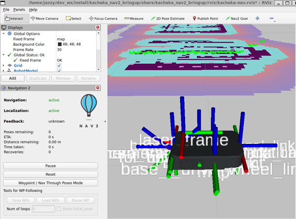

# kachaka_ROS2_package

kachaka用ROS2パッケージ

## 目次
<!-- TOC -->

- [概要](#概要)
- [はじめに](#はじめに)
- [開発環境](#開発環境)
- [ハードウェア](#ハードウェア)
- [パッケージ構成](#パッケージ構成)
- [インストール方法](#インストール方法)
- [使用方法](#使用方法)

<!-- /TOC -->

## 概要
業務向け自律搬送ロボットの [カチャカ](https://kachaka.life/)を用いたNavigation2(Nav2)での自律移動やコントローラでの操作などのをROS2で制御する為のリポジトリを提供します。
主に以下のパッケージで構成されています

|パッケージ名|説明|
|---|---|
|kachaka_description|カチャカのdescriptionを記述するパッケージ。[kachaka_description](https://github.com/pf-robotics/kachaka-api/tree/v3.8.5/ros2/kachaka_description)から派生しています。|
|kachaka_interfaces|カチャカのアクション、メッセージファイルを管理するパッケージ。[kachaka_interfaces](https://github.com/pf-robotics/kachaka-api/tree/v3.8.5/ros2/kachaka_interfaces)から派生しています。|
|kachaka_nav2_bringup|Nav2 stackを起動するためのパッケージ。[kachaka_nav2_bringup](https://github.com/pf-robotics/kachaka-api/tree/v3.8.5/ros2/demos/kachaka_nav2_bringup)から派生しています。|
|kachaka_mapping|Mappingを起動するためのパッケージ|
|kachaka_gazebo|Gazebo Ignitionによるカチャカのシミュレーション環境を提供するパッケージ|
|utils/joy_controller|ユーティリティ|

kachaka_ros2_dev_kitは、カチャカ実機、シミュレーション環境で地図生成、自己位置推定、ナビゲーションを実行する機能を提供します。
シミュレーション環境（kachaka_gazeboパッケージ）を使ってナビゲーションを実行した例を下図に示します。

|シミュレーション環境|シミュレーション環境上でのナビゲーション実行例|
|:---:|:---:|
|||


## はじめに

ビルド
```bash
mkdir -p ~/your_ws/src
cd ~/your_ws/src
git clone https://github.com/ndlab-ros2/kachaka_ros2.git
cd ..
rosdep install -y -i --from-paths src
colcon build --packages-skip wiimote
source install/setup.bash
```

kachaka-apiによる接続
```bash
cd ~/kachaka-api/tools/ros2_bridge
./start_bridge.sh <kachakaのIPアドレス>
```

※kachakaをアップデートした際は新しいDocker環境が必要になるので、以下のコマンドを実行して既存のDocker環境を削除しなければならない
```bash
# 停止中コンテナの削除（必要に応じて）
docker container prune -f

# 既存のros2_bridgeサービスの削除
docker-compose down --volumes --remove-orphans

# 古いイメージの削除（ピンポイントで削除するのが安全）
docker rmi asia-northeast1-docker.pkg.dev/kachaka-api/docker/kachaka-grpc-ros2-bridge:20250213
```
そして再びkachaka-apiでの接続を行う
```bash
cd ~/kachaka-api/tools/ros2_bridge
./start_bridge.sh <kachakaのIPアドレス>
```

マップサーバーの起動
```bash
ros2 run nav2_map_server map_server --ros-args -p yaml_filename:=/path/to/your/map.yaml
```
