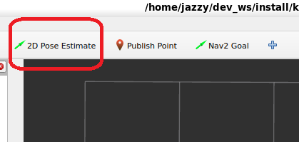
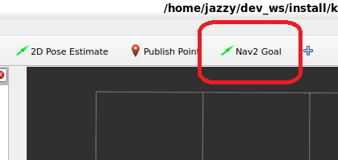

# ナビゲーション

ここではシミュレータ環境を用いてナビゲーションを行う手順を説明します。

## シミュレータ起動

以下のコマンドを実行してGazebo Ignitionを起動します。

```bash
ros2 launch kachaka_gazebo simulation.launch.py
```

Gazebo IgnitionでGUIが不要な場合、`headless:=True`を指定することでヘッドレスモードで起動できます。

```bash
ros2 launch kachaka_gazebo simulation.launch.py headless:=True
```

## 自己位置推定

以下のコマンドを実行して自己位置推定を起動します。シミュレータ環境を用いるため、`use_sim_time:=true`としています。

```bash
ros2 launch kachaka_nav2_bringup localization_launch.py use_sim_time:=true map:=<map_yaml_path>
```

作成済の地図データ（`depot.yaml`）を用いる場合の実行例を以下に示します。

```bash
ros2 launch kachaka_nav2_bringup localization_launch.py use_sim_time:=true map:=$HOME/dev_ws/src/kachaka_ros2_dev_kit/kachaka_nav2_bringup/maps/depot.yaml
```

その後、RViz2の「2D Pose Estimate」を押し、ロボットの初期位置姿勢を指定します。



## ナビゲーション起動

以下のコマンドを実行してナビゲーションを起動します。シミュレータ環境を用いるため、`use_sim_time:=true`としています。

```bash
ros2 launch kachaka_nav2_bringup navigation_launch.py use_sim_time:=true
```

その後、RViz2の「Nav2 Goal」を押し、ナビゲーションの目標位置姿勢を指定します。


